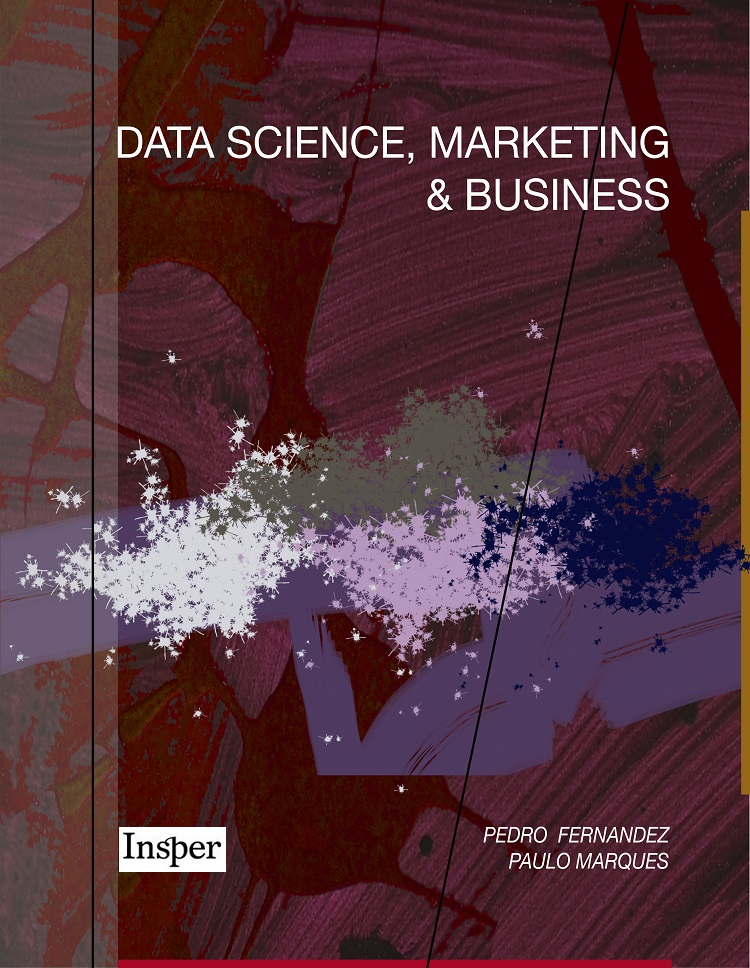

```{r global_options, echo = FALSE}
knitr::opts_chunk$set(message = FALSE, warning = FALSE, fig.retina = 3)

options(htmltools.dir.version = FALSE)

```


```{r setup, include=FALSE}
library(icon)
library(tidyverse)
library(knitr)
library(plotly)

theme_set(theme_bw())

```


class: clear

.pull-left[

```{r, echo = FALSE, out.width = "90%"}

```

]


.pull-right[
O livro pode ser acessado em [datascience.insper.edu.br](https://datascience.insper.edu.br).

Um pouco da história do professor Pedro Fernandez e do livro pode ser acessada nesse [link](https://www.insper.edu.br/agenda-de-eventos/lancamento-do-livro-data-science-marketing-business).

Tive o prazer de colaborar, em conjunto com os professores Paulo Marques e Hedibert F. Lopes, na produção do livro do professor Pedro Fernandez. 

]


---

class: inverse, center, middle

# Introdução


---

# Motivação

Dados do [The World Bank](https://data.worldbank.org/)


```{r, echo = FALSE, dev = "svg", fig.align = 'center'}
dados <- data.frame(Pais = c("Argentina", "Brasil", "Canadá", "Japão"),
                    GDP = c(11652.6, 8920.8, 46210.5, 39286.7), # GDP per capita (current US$) 2018
                    LifExp = c(76, 75, 82, 84), # Life expectancy at birth, total (years)
                    Researchers = c(1233, 881, 4275, 5305), # Researchers in R&D (per million people) 
                    stringsAsFactors = FALSE) 

dados %>% 
  kable(format = "html", align = c(rep("c", 3)))
```


GDP per capita (current US$) / Life expectancy at birth, total (years) / Researchers in R&D (per million people) 


---

# Motivação


```{r, echo = FALSE, dev = "svg", fig.align = 'center'}
dados[,2:4] <- scale(dados[,2:4])

library(plotly)

plot_ly(dados, x = ~GDP, 
               y = ~LifExp, 
               z = ~Researchers, 
               color = ~Pais, 
               marker = list(size = 6)) %>% 
  layout(legend = list(orientation = 'h'))


```


---

# Motivação

```{r, echo = FALSE, fig.align = "center", fig.width=12, fig.height=8, dev = "svg"}
dist_eucl <- dist(dados[,-1], diag = TRUE, upper = TRUE)

mds <- cmdscale(dist_eucl, k = 2, eig = TRUE)

dados_mds <- data.frame(Pais = dados$Pais, 
                        Coord1 = mds$points[,1],
                        Coord2 = mds$points[,2])

library(ggrepel)

dados_mds %>% 
  ggplot(aes(Coord1, Coord2, label = Pais)) + 
  geom_point(size = 4, col = "red") + 
  geom_text_repel(size = 8) + 
  xlab("Coordenada 1") + ylab("Coordenada 2")

```


---

# Motivação

Distäncia dos pontos em $\mathbb{R}^3$
```{r, echo = FALSE, dev = "svg"}

dist_eucl <- as.matrix(dist_eucl)
dimnames(dist_eucl) <- list(dados$Pais, dados$Pais)

dist_eucl %>%
  round(3) %>% 
  kable(format = "html", align = c(rep("c", 3)))
  
```


Distäncia dos pontos pelo **MDS** (em $\mathbb{R}^2$)
```{r, echo = FALSE, dev = "svg"}
dist_eucl <- as.matrix(dist_eucl)
dimnames(dist_eucl) <- list(dados$Pais, dados$Pais)

dist_mds <- dados_mds[,2:3] %>% 
              dist(diag = TRUE, upper = TRUE) %>% 
              as.matrix()

dimnames(dist_mds) <- list(dados_mds$Pais, dados_mds$Pais)

dist_mds %>%
  round(3) %>% 
  kable(format = "html", align = c(rep("c", 3)))
  
```


---

# Resumindo

.middle[
* Queremos representar observações de alta dimensão num número reduzido de dimensões.


* Podemos fazer isso com base nos dados brutos ou diretamente de uma matriz de dissimilaridades.
]


---

class: inverse, center, middle

# Aplicação


---

# Introdução


Consumidores (n = 150) recebem 30 papeletas com modelos de carros e agrupam os carros considerados equivalentes (substituíveis no momento da compra).

--

Este processo define uma medida de dissimilaridade por:

--
$$d_{ij} = \frac{n - \text{quantas vezes } i \text{ e } j \text{ foram alocados no mesmo grupo}}{n}$$
--

Assim, 

- $d_{ij} = 0$ quando os modelos $i$ e $j$ são alocados dentro do mesmo grupo por todos os consumidores,

--

- $d_{ij} = 1$ se $i$ e $j$ não forem alocados dentro do mesmo grupo por nenhum consumidor.


---

# Exemplo

```{r, echo = FALSE}
data.frame(id  = paste("Cliente", c(1:5)), 
           Ka  = c( 2, 2, "", "",  2),
           Uno = c( 2, 2, "", "",  2), 
           Gol = c( 1, 1,  1,  1,  1),
           Fox = c( 1, 1,  1,  1,  1),
           Fit = c("", 1, "",  1, "")) %>% 
  kable(format = 'html', align = c(rep("c", 5)))

```

$$d_{ij} = \frac{n - \text{quantas vezes } i \text{ e } j \text{ foram alocados no mesmo grupo}}{n}$$
--

$$d_{\text{Fox},\text{Gol}} = \frac{5 - 5}{5} = 0$$

--

$$d_{\text{Fit},\text{Gol}} = \frac{5 - 2}{5} = 0.6$$

--

$$d_{\text{Fit},\text{Uno}} = \frac{5 - 0}{5} = 1$$


---

# Leitura dos dados

```{r}
dissim <- read.csv("matriz_dissimilaridades.csv", row.names = 1)

dissim %>% 
  round(2) %>% 
  head() %>% 
  kable(format = 'html', align = c(rep("c", ncol(dissim))))

```


---


# Matriz de Dissimilaridades

```{r, echo = TRUE, eval = FALSE}
ggplotly(
  dissim %>%
    mutate("mod1" = rownames(dissim)) %>% 
    pivot_longer(-mod1, names_to = "mod2", values_to = "dissim") %>% 
    ggplot(aes(mod1, mod2, fill = dissim)) + 
      geom_tile() + xlab("") + ylab("") + 
      scale_fill_gradient(low = "white", high = "red4", 
                          limit = c(0,1), name = "Dissimilaridades") + 
      theme(axis.text.x = element_text(angle = 90))
)

```


---


# Matriz de Dissimilaridades


```{r, echo = FALSE, out.width="90%", out.height="105%", dev = "svg"}

ggplotly(
  dissim %>%
    mutate("mod1" = rownames(dissim)) %>% 
    pivot_longer(-mod1, names_to = "mod2", values_to = "dissim") %>% 
    ggplot(aes(mod1, fct_rev(mod2), fill = dissim)) + 
      geom_tile() + xlab("") + ylab("") + 
      scale_fill_gradient(low = "white", high = "red4", 
                          limit = c(0,1), name = "Dissimilaridades") + 
      theme(axis.text.x = element_text(angle = 90))
)

```


---

# MDS

```{r}
cars_mds <- cmdscale(dissim, k = 2, eig = TRUE)

head(cars_mds$points)
```


---

# Simulação

```{r, echo = FALSE, out.width="65%", out.height="65%", cache=TRUE}

simulacao <- function(k){

  cars_mds <- cmdscale(dissim, k = k, eig = TRUE)
  
  dissim_longer <- dissim %>% 
                    data.frame() %>% 
                    mutate(marca = rownames(dissim)) %>% 
                    pivot_longer(-marca, names_to = "modelos", values_to = "dist_dissim")
  
  mds_longer <- cars_mds$points %>% 
                  dist(diag = TRUE, upper = TRUE) %>% 
                  as.matrix() %>% data.frame() %>% 
                  mutate(marca = rownames(cars_mds$points)) %>% 
                  pivot_longer(-marca, names_to = "modelos", values_to = "dist_mds")
    
  
  distancias <- dissim_longer %>% 
                  left_join(mds_longer, by = c("marca", "modelos"))
  
  distancias$R2 <- summary(lm(dist_dissim ~ dist_mds, distancias))$r.squared
  distancias$k <- k
  
  return(distancias)

}


resultados <- simulacao(1)

for(i in 2:(nrow(dissim) - 1)) resultados <- rbind(resultados, simulacao(i))

library(gganimate)

resultados %>% 
  ggplot(aes(dist_dissim, dist_mds)) + 
    geom_point(size = 3, alpha = .4, color = "steelblue3") + 
    xlab("Dissimilaridade") + ylab("Distância MDS") + 
    transition_states(k) +
    ggtitle("k =  {closest_state}") + 
    theme(plot.title = element_text(color = "red", size = 16, face="bold.italic"))
    

```


---

# Projeção

```{r, echo = FALSE, fig.align = "center", fig.width=12, fig.height=8, dev = "svg"}
library(ggrepel)

df <- data.frame(mod = rownames(cars_mds$points),
                 coord1 = cars_mds$points[,1],
                 coord2 = cars_mds$points[,2])

ggplot(df, aes(x = coord1, y = coord2, label = mod)) +
  geom_point(alpha = 0.55, size = 4) +
  geom_text_repel(size = 5) + 
  xlab("Coordenada 1") + ylab("Coordenada 2") + 
  theme_bw()

```


---

# Cluster

```{r, eval = FALSE}
carsHC <- hclust(dist(cars_mds$points))

library(factoextra)

fviz_dend(carsHC, 
          k = 3,
          cex = 1,
          horiz = TRUE,
          rect = TRUE, rect_fill = TRUE,
          color_labels_by_k = TRUE,
          main = "", 
          ggtheme = theme_bw(), 
          )
```


---

# Cluster

```{r, echo = FALSE, fig.width=12, fig.height=8, dev = "svg"}
carsHC <- hclust(dist(cars_mds$points))

library(factoextra)

fviz_dend(carsHC, 
          k = 3,
          cex = 1,
          horiz = TRUE,
          rect = TRUE, rect_fill = TRUE,
          color_labels_by_k = TRUE,
          main = "", 
          ggtheme = theme_bw(), 
          )

```


---

# Cluster

```{r, echo = TRUE, eval = FALSE}

library(ggrepel)

clusters <- cutree(carsHC, k = 3)

df <- data.frame(mod = rownames(cars_mds$points),
                 coord1 = cars_mds$points[,1],
                 coord2 = cars_mds$points[,2],
                 cluster = factor(clusters))

ggplot(df, aes(x = coord1, y = coord2, label = rownames(df))) +
  geom_point(aes(color = cluster), alpha = 0.55, size = 4) +
  xlab("Coordenada 1") + ylab("Coordenada 2") + 
  geom_text_repel(size = 5) + 
  theme_bw()

```


---

# Cluster

```{r, echo = FALSE, fig.align = "center", fig.width=12, fig.height=8, dev = "svg"}

library(ggrepel)

clusters <- cutree(carsHC, k = 3)

df <- data.frame(mod = rownames(cars_mds$points),
                 coord1 = cars_mds$points[,1],
                 coord2 = cars_mds$points[,2],
                 cluster = factor(clusters))

ggplot(df, aes(x = coord1, y = coord2, label = rownames(df))) +
  geom_point(aes(color = cluster), alpha = 0.55, size = 4) +
  xlab("Coordenada 1") + ylab("Coordenada 2") + 
  geom_text_repel(size = 5) + 
  theme_bw()

```


---

# Aplicação


Os clusters formados podem ser utilizados de diversas maneiras:

--

- carros dentro de um mesmo cluster indicam **concorrentes diretos**, e esta informação pode ser utilizada por um dos players do mercado no monitoramento das atividades das empresas concorrentes. 

--

- **sistemas de recomendação** simples também podem ser construídos. Por exemplo, usuários que navegaram na Internet fazendo buscas pelo modelo “Saveiro”, poderiam ser expostos a anúncios de modelos do mesmo cluster (“Pálio”, “Parati” etc).


---

class: inverse, center, middle

# Mercado de Scotch Whisky


---

# Mercado de Whisky


```{r, echo = TRUE}

library(bayesm)

data(Scotch)

Scotch %>% 
  kable(format = "html", align = c(rep("c", 21)))

```


---

# Mercado de Whisky


Quando cada atributo assume apenas os valores 0 e 1, podemos definir a **distância de Jaccard** da seguinte forma:


$$d_{AB} = 1 - \frac{|A \cap B|}{|A \cup B|}= 1 - \frac{\sum_{m = 1}^{p}x_{Am}x_{Bm}}{\sum_{m = 1}^{p}x_{Am} + \sum_{m = 1}^{p}x_{Bm} - \sum_{m = 1}^{p}x_{Am}x_{Bm}}.$$

```{r, echo = TRUE}

jaccard <- matrix(rep(0, ncol(Scotch)^2), ncol = ncol(Scotch))

dimnames(jaccard) <- list(colnames(Scotch), colnames(Scotch))

for (i in 1:(ncol(Scotch) - 1)){
  for (j in (i + 1):ncol(Scotch)){
    jaccard[i, j] <- 1 - sum(Scotch[,i]*Scotch[,j]) / 
                     (sum(Scotch[,i]) + sum(Scotch[,j]) - sum(Scotch[,i]*Scotch[,j]))
    jaccard[j, i] <- jaccard[i, j] 
  }
}

```


---

# Mercado de Whisky


```{r, echo = TRUE, eval = FALSE}

mds <- cmdscale(jaccard, eig = TRUE) 

hc <- hclust(dist(mds$points))

library(factoextra)

fviz_dend(hc, 
          k = 6,
          cex = 0.9,
          horiz = TRUE,
          rect = TRUE, rect_fill = TRUE,
          color_labels_by_k = TRUE,
          main = "",
          ggtheme = theme_bw()
          )
```


---

# Mercado de Whisky


```{r, echo = FALSE, fig.width=12, fig.height=8, dev = "svg"}

mds <- cmdscale(jaccard, eig = TRUE) 

hc <- hclust(dist(mds$points))

library(factoextra)

fviz_dend(hc, 
          k = 6,
          cex = 0.9,
          horiz = TRUE,
          rect = TRUE, rect_fill = TRUE,
          color_labels_by_k = TRUE,
          main = "",
          ggtheme = theme_bw()
          )
```


---

# Mercado de Whisky


```{r, echo = TRUE, eval = FALSE}
clusters <- cutree(hc, k = 6)

df <- data.frame(wishky = rownames(mds$points),
                 coord1 = mds$points[,1],
                 coord2 = mds$points[,2],
                 cluster = factor(clusters))

ggplot(df, aes(x = coord1, y = coord2, label = rownames(df))) +
    geom_point(aes(color = cluster), alpha = 0.55, size = 4) +
    xlab("Coordenada 1") + ylab("Coordenada 2") + 
    geom_text_repel() + theme_bw()
```


---

# Mercado de Whisky


```{r, echo = FALSE, fig.width=12, fig.height=8, dev = "svg"}
clusters <- cutree(hc, k = 6)

df <- data.frame(wishky = rownames(mds$points),
                 coord1 = mds$points[,1],
                 coord2 = mds$points[,2],
                 cluster = factor(clusters))

ggplot(df, aes(x = coord1, y = coord2, label = rownames(df))) +
    geom_point(aes(color = cluster), alpha = 0.55, size = 4) +
    xlab("Coordenada 1") + ylab("Coordenada 2") + 
    geom_text_repel(size = 6) + theme_bw()
```


---

# Mercado de Whisky


Os clusters obtidos revelam a estrutura de concorrência no mercado de Scotch whisky que pode ser utilizara para:

- formação de estoques e pedidos de compra

--

- organização de prateleiras em pontos de venda

--

- sistemas de recomendação.


---
class: clear, center, middle


.font150[**Obrigado!**]


Mais exemplos podem ser encontrados no livro [Data Science, Marketing & Business](https://datascience.insper.edu.br)

Contato e redes sociais em [**tiagoms.com**](https://tiagoms.com)

Apresentação criada no pacote [xaringan](https://github.com/yihui/xaringan).

Um agradecimento especial aos **organizadores** e **patrocinadores** do evento! 


